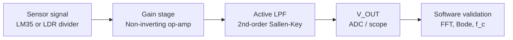
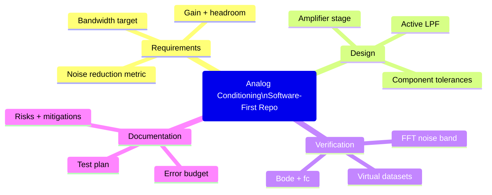

# Analog Signal Conditioning and Measurement System

Software-first (no-hardware-required) analog design project: requirements → design → error budget → virtual validation → data analysis.

## Problem Statement

Slow sensors (temperature, light) produce low-level signals that are easy to corrupt with breadboard/ambient pickup (mains hum, coupling, ADC noise). A practical measurement system needs:

- predictable gain and headroom
- a defined bandwidth (active low-pass) to reject high-frequency noise
- a repeatable way to verify performance (gain, $f_c$, noise reduction)

## Proposed Solution (Software-Sufficient)

This repository provides a complete, reproducible workflow to design and *virtually validate* an analog conditioning chain:

- documented circuit topology and calculations
- tolerance and error budget reasoning
- synthetic datasets that emulate real lab captures
- automated plots and metrics (time plots, FFT, Bode magnitude, $f_c$ extraction)

Physical hardware build is optional; the repo stands on its own as a software validation project.

## Quick Start

Software-only demo (recommended):

```bash
python -m venv .venv && source .venv/bin/activate
pip install -r requirements.txt

# One-command demo (generates results/)
MPLBACKEND=Agg python scripts/run_demo.py
```

Outputs:

- `results/demo.png`: input vs output (time) + spectra (FFT)
- `results/bode.png`: sweep/Bode magnitude with extracted $f_c$
- `results/synthetic_sweep.csv`: synthetic sweep data (example input)

Note: `MPLBACKEND=Agg` forces matplotlib into a non-GUI backend so plots can be saved in headless environments (CI, containers, SSH).

Hardware build (optional):

1. Wire the circuit using the pin-level instructions below.
2. Power from a regulated 5 V supply.
3. Verify DC gains and filter cutoff using the lab plan in [docs/04_test_plan.md](docs/04_test_plan.md).

## What’s in this Repo

- [README.md](README.md): build guide + overview
- [docs/01_requirements.md](docs/01_requirements.md): requirements and assumptions
- [docs/02_design_rationale.md](docs/02_design_rationale.md): design rationale and constraints
- [docs/03_error_budget.md](docs/03_error_budget.md): error budget and tolerance impact
- [docs/04_test_plan.md](docs/04_test_plan.md): repeatable lab test plan
- [docs/05_calibration.md](docs/05_calibration.md): calibration workflow
- [docs/06_risk_and_mitigations.md](docs/06_risk_and_mitigations.md): risk register and mitigations
- [analysis.py](analysis.py): CLI wrapper (time-series)
- [sweep_analysis.py](sweep_analysis.py): CLI wrapper (sweep/Bode)
- [scripts/analysis.py](scripts/analysis.py): library (time-series + FFT)
- [scripts/sweep_analysis.py](scripts/sweep_analysis.py): library (Bode + $f_c$)
- [scripts/run_demo.py](scripts/run_demo.py): generates synthetic results into results/
- [data/README.md](data/README.md): CSV formats

## System Overview

Signal path:

`Sensor (LM35 or LDR divider) -> non-inverting amplifier -> 2nd-order Sallen-Key LPF -> V_OUT`

This targets slow sensor signals (DC–few Hz) while suppressing typical breadboard pickup (tens of Hz and above).





## Circuit Design

### 1) Sensor Stage

The LM35 provides 10 mV/degC with no calibration offset. At 25 degC the output is about 250 mV. This is small enough that the next op-amp stage is needed to improve resolution.

Recommended connections:

- LM35 VCC to +5 V
- LM35 GND to 0 V
- LM35 output to the amplifier input
- Place a 100 nF decoupling capacitor close to the LM35 supply pins

LM35 note (important): TO-92 pinouts can vary by vendor/variant. Verify your LM35 pin order from the datasheet before powering it.

#### Alternative Sensor Option (LDR)

If you prefer an LDR instead of temperature:

- Make a voltage divider: `+5 V -> LDR -> V_LDR -> R_FIXED -> GND`
- Choose `R_FIXED = 10 kOhm` as a good starting point.
- Use `V_LDR` as the input to the amplifier stage.

This produces a slow-changing voltage that increases or decreases with light depending on whether the LDR is on the top or bottom of the divider.

### 2) Amplifier Stage

Use the first half of an LM358 as a non-inverting amplifier.

Gain formula:

`Av = 1 + (Rf / Rg)`

Choose:

- `Rg = 10 kOhm`
- `Rf = 40 kOhm`

Then:

`Av = 1 + 40k / 10k = 5`

This maps the LM35 output into a more useful voltage range while staying within a 5 V supply.

Example output levels:

- 0 degC -> 0.000 V in, 0.000 V out
- 25 degC -> 0.250 V in, 1.250 V out
- 50 degC -> 0.500 V in, 2.500 V out

### 3) Active Low-Pass Filter

Use the second half of the LM358 as a Sallen-Key low-pass filter. For a breadboard build, this is practical, stable, and easy to tune.

Target cutoff frequency:

`fc = 10 Hz`

For equal components in a Sallen-Key stage:

`fc = 1 / (2 pi R C)`

Choose:

- `R1 = R2 = 15 kOhm`
- `C1 = C2 = 1 uF`

Then the approximate cutoff frequency is:

`fc = 1 / (2 pi * 15,000 * 1e-6) = 10.6 Hz`

For a Butterworth response, set the non-inverting gain of the filter op-amp to about 1.586:

`K = 1 + (Rf / Rg) = 1.586`

One practical choice is:

- `Rg = 10 kOhm`
- `Rf = 5.9 kOhm`

This gives a flat passband with strong suppression of sensor noise above the cutoff.

Sallen-Key node description (equal-component form):

- `Vin_filt` is the input to the filter (from the amplifier output)
- `Vin_filt -> R1 -> node V1 -> R2 -> node V2`
- `C1` from `V1` to `GND`
- `C2` from `V2` to `GND`
- `V2` goes to the op-amp non-inverting input
- The op-amp is configured non-inverting with gain `K = 1 + Rf/Rg`
- Filter output is the op-amp output

## Text Circuit Diagram

```text
5 V supply
	|
  LM35 temperature sensor (or LDR divider)
	|
	+----> non-inverting amplifier (LM358, Av = 5)
					|
					+----> Sallen-Key active low-pass filter (fc approx. 10.6 Hz)
								  |
								  +----> conditioned measurement output
```

## Breadboard Wiring (Pin-Level)

This assumes:

- LM358 in DIP-8 package
- Single supply: `+5 V` and `GND`

LM358 DIP-8 pinout (most common):

- Pin 1: OUT A
- Pin 2: IN- A
- Pin 3: IN+ A
- Pin 4: V-
- Pin 5: IN+ B
- Pin 6: IN- B
- Pin 7: OUT B
- Pin 8: V+

### Power and decoupling

1. Pin 8 to `+5 V`, pin 4 to `GND`.
2. Place a `100 nF` capacitor from pin 8 to pin 4 (close to the chip).

### Stage 1: Non-inverting amplifier (Op-amp A)

Goal: `Av1 = 5`.

1. Sensor output node (`V_SENSOR`) to pin 3 (IN+ A).
2. `Rg = 10 kOhm` from pin 2 (IN- A) to `GND`.
3. `Rf = 40 kOhm` from pin 1 (OUT A) to pin 2 (IN- A).
4. The amplified output node is pin 1. Call this node `V_AMP`.

### Stage 2: Sallen-Key low-pass (Op-amp B)

Goal: `fc approx. 10.6 Hz`, Butterworth.

1. `R1 = 15 kOhm` from `V_AMP` to node `V1`.
2. `C1 = 1 uF` from `V1` to `GND`.
3. `R2 = 15 kOhm` from `V1` to node `V2`.
4. `C2 = 1 uF` from `V2` to `GND`.
5. Node `V2` to pin 5 (IN+ B).
6. Configure op-amp B as non-inverting with `K = 1.586`:
	- `Rg = 10 kOhm` from pin 6 (IN- B) to `GND`
	- `Rf = 5.9 kOhm` from pin 7 (OUT B) to pin 6 (IN- B)
7. The conditioned measurement output is pin 7. Call this node `V_OUT`.

Polarity note for electrolytic capacitors: if you use electrolytics for `1 uF`, connect the positive side to the signal node (`V1`/`V2`) and the negative side to `GND`.

### Practical Breadboard Notes

- Use a single +5 V supply and a common ground rail.
- Add 100 nF bypass capacitors across the LM358 supply pins.
- Keep sensor and op-amp grounds tied to the same low-impedance ground node.
- Use short jumper wires to reduce pickup.
- If the output needs to drive an ADC, add another buffer stage only if the ADC input impedance is low.

## Gain Calculations

### Sensor sensitivity

The LM35 sensitivity is 10 mV/degC.

### Amplifier gain

`Av1 = 5`

### Filter gain

For the chosen Sallen-Key stage:

`Av2 = 1.586`

### Overall gain

`Av_total = Av1 * Av2 = 5 * 1.586 = 7.93`

### Overall temperature scaling

`Vout = 7.93 * 10 mV/degC * T`

So the output sensitivity is approximately:

`79.3 mV/degC`

Example:

- 25 degC -> about 1.98 V
- 50 degC -> about 3.97 V

This is a comfortable range for a 5 V breadboard build.

## Filter Design Calculations

Using `R = 15 kOhm` and `C = 1 uF`:

`fc = 1 / (2 pi R C)`

`fc = 1 / (2 pi * 15,000 * 1e-6)`

`fc = 10.6 Hz`

Interpretation:

- Frequencies much lower than 10.6 Hz pass with little attenuation.
- Frequencies well above 10.6 Hz are increasingly suppressed.
- This is suitable for temperature signals, which change slowly.

## Measurement Procedure

### Measuring noise reduction

1. Apply a steady temperature or a stable sensor condition.
2. Measure the raw sensor node and the conditioned output with an oscilloscope.
3. Record peak-to-peak ripple or RMS noise at both points.
4. Compare the values.

Useful metric:

`Noise reduction (dB) = 20 log10(Vnoise_in / Vnoise_out)`

If the output noise is smaller than the input noise by a factor of 4, the reduction is:

`20 log10(4) = 12.0 dB`

### Verifying cutoff frequency experimentally

1. Disconnect the sensor and inject a small sine wave from a function generator.
2. Sweep frequency from 1 Hz upward while keeping the input amplitude constant.
3. Measure the output amplitude at each frequency.
4. Find the frequency where the output falls to 0.707 of the passband level, which is the -3 dB point.

Expected result:

- Passband gain is nearly constant below about 10 Hz.
- At about 10.6 Hz the output should be about 70.7 percent of the low-frequency amplitude.

## Data Analysis

Use the supplied Python script to:

- plot input vs output waveforms
- visualize how noise is reduced after filtering
- compare spectra and observe attenuation above the cutoff frequency

Note: the script models the active filter as a 2nd-order Butterworth low-pass (digital biquad) so the plotted frequency response is representative of the analog Sallen-Key stage.

Demo run (generates results/demo.png and results/bode.png):

```bash
MPLBACKEND=Agg python scripts/run_demo.py
```

Time-series analysis (your CSV):

```bash
python analysis.py --csv data/data.csv --time-col time --input-col input --output-col output --no-show --save results/time_fft.png
```

Sweep/Bode analysis (your sweep CSV):

```bash
python sweep_analysis.py --csv data/sweep.csv --no-show --save results/bode.png
```

Or plot your own CSV data:

```bash
python analysis.py --csv data.csv --input-col input --output-col output
```

If your CSV only contains the raw input signal, omit `--output-col` and the script will generate a filtered output automatically.

## Python Code

See [analysis.py](analysis.py) for a ready-to-run plotting script.

## Observations

- The LM35 output is low-level, so the amplifier stage improves readability.
- The active low-pass filter removes fast noise while preserving the slow temperature trend.
- A 5 V single-supply LM358 implementation is practical on a breadboard, but output swing near the top rail is limited.

## Improvements

- Replace the LM358 with a rail-to-rail op-amp for better output swing.
- Add a reference voltage and offset stage if negative or centered signals are required.
- Use a 2nd-order Butterworth filter if stronger attenuation is needed.
- Add an ADC and microcontroller for logging, calibration, and display.
- Add shielding or twisted pair wiring for longer sensor leads.

## Suggested Bill of Materials

- 1 x LM35 temperature sensor
- 1 x LM358 dual op-amp
- 2 x 100 nF ceramic capacitors for decoupling
- 2 x 1 uF capacitors for the filter
- 2 x 15 kOhm resistors for the filter
- 1 x 10 kOhm resistor for the amplifier
- 1 x 40 kOhm resistor for the amplifier
- 1 x 10 kOhm resistor for the filter gain network
- 1 x 5.9 kOhm resistor for the filter gain network
- Breadboard, jumper wires, and a regulated 5 V supply

## Conclusion

This project demonstrates a realistic analog measurement chain: the sensor output is amplified, high-frequency noise is filtered, and the result is ready for measurement or data acquisition.
